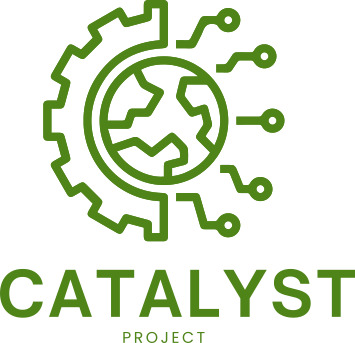

The Catalyst Project is a community-engaged initiative designed to support the adoption of open science principles in under-served bioscience research communities through the provision of reliable and sustainable cloud computing infrastructure.

See the official [Catalyst Project website](https://catalystproject.cloud) for more information.
